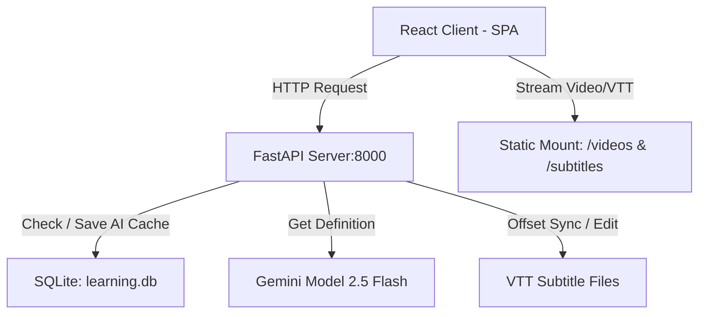

# Friends English Center

Hệ thống hỗ trợ học tiếng Anh giao tiếp qua phim bộ song ngữ thông qua phụ đề tương tác, bộ điều chỉnh độ lệch thời gian phụ đề, chế độ đục lỗ từ vựng và giải nghĩa ngữ cảnh bằng trí tuệ nhân tạo thông qua Gemini 2.5 Flash API.

---

## Khởi Chạy Nhanh

Dự án cung cấp script tự động hóa khởi chạy đồng thời cả máy chủ Backend và giao diện Frontend.

### Khởi chạy trên Windows
Chạy file script sau trong cmd:
```cmd
run_project.bat
```

### Khởi chạy trên Linux và macOS
Chạy lệnh phân quyền và khởi chạy file script trong bash:
```bash
chmod +x run_project.sh
./run_project.sh
```
*   Giao diện ứng dụng hoạt động tại địa chỉ: http://localhost:5173
*   Backend Server API hoạt động tại địa chỉ: http://localhost:8000

---

## Kiến Trúc Hệ Thống



### Chi Tiết Cấu Trúc Mã Nguồn

| Đường Dẫn File hoặc Thư Mục | Loại | Vai Trò và Chức Năng |
| :--- | :--- | :--- |
| `backend/app/main.py` | Python | API Router chính chịu trách nhiệm mount thư mục tĩnh truyền phát Video và Subtitles. |
| `backend/app/database/db.py` | Python | Service quản lý SQLite Database learning.db dùng để lưu từ vựng và cache của AI. |
| `frontend/src/App.jsx` | React | Controller chính xử lý logic phím tắt và điều phối luồng phát video. |
| `frontend/src/components/Sidebar.jsx` | React | Sidebar quản lý chọn tập phim, tab kịch bản phim, từ vựng và các câu thoại đã lưu. |
| `frontend/src/components/AiExplainPanel.jsx` | React | Hiển thị giải nghĩa ngữ cảnh từ AI và cung cấp nút Áp dụng kịch bản để ghi đè phụ đề. |
| `frontend/src/components/DictionaryPopover.jsx` | React | Popover tra cứu nhanh nghĩa từ vựng trực tiếp trên video với phiên âm IPA và âm thanh phát âm. |
| `frontend/src/components/StudyControls.jsx` | React | Quản lý thiết lập tự dừng sau mỗi câu và các cấp độ đục lỗ từ vựng. |

---

## Hướng Dẫn Tải Phim và Phụ Đề Tự Động

Hệ thống tích hợp sẵn script `scripts/download_season.py` để tải video, tự động tạo phụ đề song ngữ song song từ trang học liệu và lưu trữ vào đúng thư mục cấu trúc của dự án.

### Cấu hình tham số dòng lệnh CLI
```bash
python scripts/download_season.py [-w SHOW] [-s SEASON] [-u URL] [-p PREFIX]
```

| Tham số | Ý Nghĩa | Giá trị mặc định | Ví dụ sử dụng |
| :--- | :--- | :--- | :--- |
| `-w`, `--show` | Thư mục của phim trong thư mục data | friends | `-w the_office` |
| `-s`, `--season` | Số season của bộ phim cần tải | 1 | `-s 2` |
| `-u`, `--url` | Link trang web chứa danh sách tập phim để tự động tải | Tự động nhận diện | `-u https://example.com/videos` |
| `-p`, `--prefix` | Tiền tố tên file video và subtitle lưu trên máy | Tự động theo phim | `-p TheOffice` |

### Ví dụ sử dụng cụ thể

*   Tải Season 1 của phim Friends theo cấu hình mặc định:
    ```bash
    python scripts/download_season.py -s 1
    ```
*   Tải Season 1 của phim Silicon Valley:
    ```bash
    python scripts/download_season.py -w silicon_valley -s 1
    ```
*   Tải phim bất kỳ từ một URL danh sách tập cụ thể:
    ```bash
    python scripts/download_season.py -w the_office -s 1 -u "https://example.com/video/the-office-season-1" -p TheOffice
    ```

---

## Phím Tắt Sử Dụng

Các phím tắt hỗ trợ tối ưu hóa phản xạ nghe nói mà không cần chạm chuột:

*   **Space**: Phát hoặc tạm dừng video.
*   **S** hoặc **R**: Phát lại từ đầu câu thoại hiện tại.
*   **A**: Lùi về câu thoại phía trước.
*   **D**: Tiến đến câu thoại tiếp theo.
*   **Tab**: Lật mở nhanh từ bị đục lỗ hiện tại trong trạng thái tạm dừng.
*   **Mũi tên trái** hoặc **Mũi tên phải**: Tua nhanh lùi hoặc tiến 10 giây.

---

## Thiết Lập Ban Đầu

### 1. Cài Đặt Môi Trường Ảo Python cho Backend
```bash
python3 -m venv venv
# Kích hoạt môi trường ảo
source venv/bin/activate
# Cài đặt thư viện cần thiết
pip install fastapi uvicorn deep-translator google-genai python-dotenv
```

### 2. Cài Đặt dependencies cho Frontend
```bash
cd frontend && npm install && cd ..
```

### 3. Cấu Hình API Key Gemini
Tạo một file `.env` ở thư mục gốc của dự án:
```env
GEMINI_API_KEY=your_gemini_api_key_here
```
