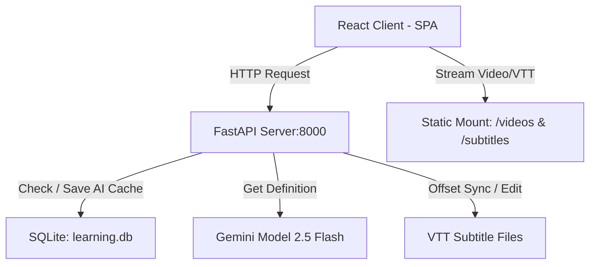

# 🎓 Friends English Center (Học Tiếng Anh Qua Phim Song Ngữ)

[](https://vite.dev/)
[](https://fastapi.tiangolo.com/)
[](https://www.sqlite.org/)
[](https://ai.google.dev/)

Ứng dụng hỗ trợ học tiếng Anh giao tiếp qua phim bộ song ngữ thông qua hệ thống phụ đề tương tác, sửa đồng bộ lệch thời gian (Offset Adjuster), kiểm tra từ vựng (Cloze Test) và giải nghĩa ngữ cảnh bằng AI (Gemini 2.5 Flash API).

---

## ⚡ Khởi Chạy Nhanh (Quick Start)

Dự án cung cấp script tự động hóa khởi chạy đồng thời cả Frontend và Backend:

### 💻 Trên Windows (cmd)
```cmd
run_project.bat
```

### 🍎 Trên Linux / macOS (bash)
```bash
chmod +x run_project.sh
./run_project.sh
```
*   **Giao diện ứng dụng**: [http://localhost:5173](http://localhost:5173)
*   **Backend Server API**: [http://localhost:8000](http://localhost:8000)

---

## 🏗️ Kiến Trúc Hệ Thống (Architecture)



### Chi Tiết Cấu Trúc Mã Nguồn

| Đường Dẫn File/Thư Mục | Loại | Vai Trò & Chức Năng |
| :--- | :--- | :--- |
| `backend/app/main.py` | Python | API Router chính. Mount thư mục tĩnh truyền phát Video/Subtitles. |
| `backend/app/database/db.py` | Python | Service quản lý SQLite Database (`learning.db`) lưu từ vựng & AI cache. |
| `frontend/src/App.jsx` | React | Controller chính, xử lý logic Keyboard shortcuts & điều phối video. |
| `frontend/src/components/Sidebar.jsx` | React | Sidebar quản lý chọn tập phim, tab kịch bản script, từ vựng và câu thoại đã lưu. |
| `frontend/src/components/AiExplainPanel.jsx` | React | Hiển thị giải nghĩa ngữ cảnh từ AI và nút "Áp dụng kịch bản" ghi đè phụ đề. |
| `frontend/src/components/DictionaryPopover.jsx` | React | Popover tra cứu nghĩa từ vựng nhanh trực tiếp trên video (IPA + Audio). |
| `frontend/src/components/StudyControls.jsx` | React | Quản lý thiết lập Shadowing (Ngưng tự nói) và Blanking (Đục lỗ từ vựng). |

---

## 📥 Hướng Dẫn Tải Phim & Phụ Đề Tự Động (Data Downloader Guide)

Hệ thống tích hợp sẵn script `scripts/download_season.py` để cào (scrape) video, tự động tạo phụ đề song ngữ song song từ trang học liệu và lưu trữ vào đúng thư mục cấu trúc của dự án.

### Cấu hình tham số CLI:
```bash
python scripts/download_season.py [-w SHOW] [-s SEASON] [-u URL] [-p PREFIX]
```

| Tham số | Ý Nghĩa | Giá trị mặc định | Ví dụ |
| :--- | :--- | :--- | :--- |
| `-w`, `--show` | Thư mục của phim trong thư mục `data/` | `friends` | `-w the_office` |
| `-s`, `--season` | Số season của bộ phim cần tải | `1` | `-s 2` |
| `-u`, `--url` | Link trang Toomva chứa danh sách tập phim (Scrape tự động) | *Tự động nhận diện* | `-u https://toomva.com/...` |
| `-p`, `--prefix` | Tiền tố tên file video/subtitle lưu trên máy | *Tự động theo phim* | `-p TheOffice` |

### Ví dụ sử dụng:

*   **Tải Season 1 của phim Friends (mặc định):**
    ```bash
    python scripts/download_season.py -s 1
    ```
*   **Tải Season 1 của phim Silicon Valley:**
    ```bash
    python scripts/download_season.py -w silicon_valley -s 1
    ```
*   **Tải phim bất kỳ từ một URL danh sách tập cụ thể:**
    ```bash
    python scripts/download_season.py -w the_office -s 1 -u "https://toomva.com/video/the-office-season-1-chuyen-van-phong-phan-1=5174" -p TheOffice
    ```

---

## ⌨️ Phím Tắt Sử Dụng (Keyboard Shortcuts)

Để tối ưu hóa phản xạ nghe nói (Shadowing) không cần chạm chuột:

*   **`Space`**: Phát / Tạm dừng video.
*   **`S`** / **`R`**: Phát lại từ đầu câu thoại hiện tại.
*   **`A`**: Lùi về câu thoại phía trước.
*   **`D`**: Tiến đến câu thoại tiếp theo.
*   **`Tab`**: Lật mở nhanh từ bị đục lỗ hiện tại (khi đang tạm dừng).
*   **`←`** / **`→`**: Tua nhanh lùi / tiến 10 giây.

---

## 🔧 Thiết Lập Ban Đầu (Installation & Setup)

### 1. Cài Đặt Môi Trường Ảo Python (Backend)
```bash
python3 -m venv venv
# Kích hoạt venv (Linux/macOS)
source venv/bin/activate
# Cài đặt thư viện cần thiết
pip install fastapi uvicorn deep-translator google-genai python-dotenv
```

### 2. Cài Đặt dependencies Frontend
```bash
cd frontend && npm install && cd ..
```

### 3. Cấu Hình API Key Gemini
Tạo một file `.env` ở thư mục gốc của dự án:
```env
GEMINI_API_KEY=your_gemini_api_key_here
```
